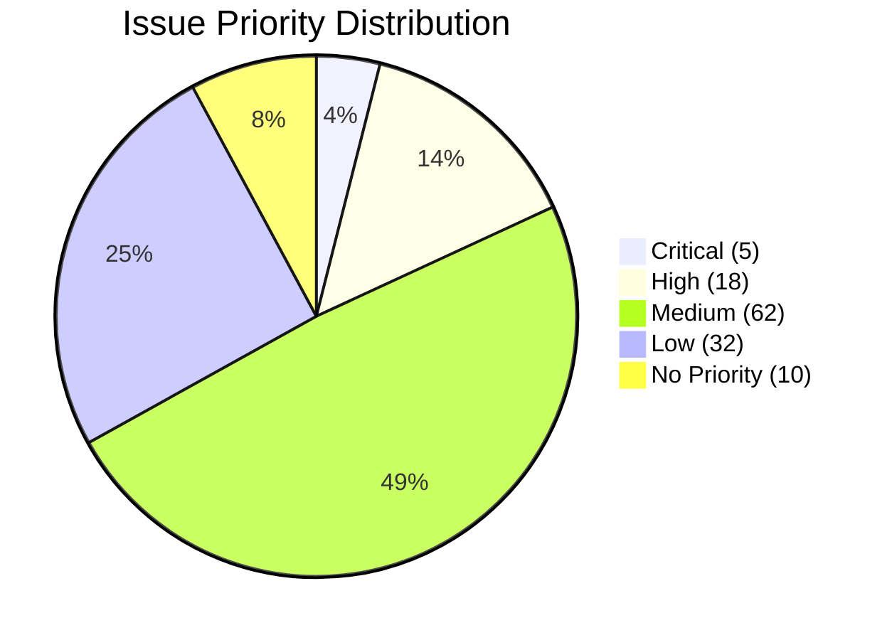

# Issue Triage Skill

Analyze and triage GitHub issues to understand their state, quality, and priority.

## Quick Usage

```bash
/issue-triage
/issue-triage --repo=owner/repo
/issue-triage --report
/issue-triage --stale
/issue-triage --unlabeled
```

## Report Output

Reports are generated to: `reports/issues/issue-report-YYYY-MM-DD.md`

```bash
# Generate triage report for current repo
/issue-triage --report

# Focus on stale issues
/issue-triage --repo=owner/repo --stale --report

# Find unlabeled issues
/issue-triage --repo=owner/repo --unlabeled --report
```

## Overview

Issue triage is the process of categorizing, prioritizing, and acting on GitHub issues. This skill analyzes issues without modifying them - it only observes and reports findings.

**Why Triage Matters:**

| Without Triage | With Triage |
|----------------|-------------|
| Issues pile up ignored | Issues get appropriate attention |
| Duplicates multiply | Duplicates get merged |
| Priority inversions | Critical items surface |
| Stale issues rot | Stale issues get closed or refreshed |

## Triage Dimensions

### 1. Issue Quality (25%)

Measures whether issues are well-formed and actionable.

| Check | Weight | Description |
|-------|--------|-------------|
| Clear title | 8 | Title describes the problem |
| Body present | 7 | Description explains the issue |
| Reproducible steps | 5 | For bugs, steps to reproduce |
| Expected vs actual | 5 | Clear success/failure criteria |

### 2. Label Coverage (20%)

Measures whether issues have appropriate labels.

| Check | Weight | Description |
|-------|--------|-------------|
| Type label | 6 | bug, feature, enhancement, etc. |
| Priority label | 6 | priority:critical, priority:medium, etc. |
| Status label | 4 | triage, ready, in-progress, etc. |
| Effort label | 4 | effort:xs, effort:m, effort:l, etc. |

### 3. Staleness Analysis (20%)

Identifies issues that need attention.

| Check | Weight | Description |
|-------|--------|-------------|
| Recently updated | 8 | Activity in last 30 days |
| Stale but valid | 7 | No activity but still relevant |
| Truly stale | 5 | Old and no longer relevant |

### 4. Priority Distribution (20%)

Analyzes priority balance across issues.

| Check | Weight | Description |
|-------|--------|-------------|
| Critical issues tracked | 8 | priority:critical have owners |
| High priority not overwhelming | 7 | High priority is manageable |
| Low priority not ignored | 5 | Some low priority issues addressed |

### 5. Duplicate Detection (15%)

Identifies potential duplicate issues.

| Check | Weight | Description |
|-------|--------|-------------|
| Similar titles | 6 | Issues with similar wording |
| Same problem described | 5 | Multiple issues for same root cause |
| Cross-references exist | 4 | Related issues linked |

## Triage Categories

### Category Definitions

#### Needs Triage (triage)
Issues that have been opened but not yet categorized.

**Criteria:**
- No type label (bug, feature, etc.)
- No priority label
- Recently opened (< 7 days)

**Action:** Assign type, priority, and effort labels.

#### Ready (ready)
Issues that are well-formed and ready to be worked on.

**Criteria:**
- Has type, priority, and effort labels
- Clear description
- Reproducible (for bugs)
- Not blocked

**Action:** These can be picked up by developers.

#### In Progress (in-progress)
Issues currently being worked on.

**Criteria:**
- Has assignee
- Linked PR exists
- Status label set

**Action:** Track for delivery.

#### Blocked (blocked)
Issues that cannot proceed.

**Criteria:**
- Has blocked label or
- Comment indicates blocker
- Depends on another issue

**Action:** Identify and resolve blockers.

#### Stale (stale)
Issues with no recent activity.

**Criteria:**
- No comments for 30+ days
- No label changes
- Not recently updated

**Action:** Close, or add comment to refresh.

#### Duplicate (duplicate)
Issues describing the same problem.

**Criteria:**
- Shares title similarity with another issue
- Describes same root cause
- Links to potential original

**Action:** Mark as duplicate, link to original.

#### Won't Fix (wontfix)
Issues that will not be addressed.

**Criteria:**
- Explicitly rejected in comments
- Out of scope
- Works as designed

**Action:** Close with explanation.

## Staleness Thresholds

| Age | Category | Action |
|-----|----------|--------|
| 0-7 days | Fresh | Normal processing |
| 7-30 days | Aging | Needs attention |
| 30-90 days | Stale | Should be closed or refreshed |
| 90+ days | Very Stale | Likely candidates for closure |

## Analyzing Issues

### Stage 1: Fetch Issue Data

```bash
# List all open issues with labels
gh issue list --state open --limit 500 --json number,title,labels,createdAt,updatedAt,assignees

# Get issue count
gh issue list --state open | wc -l

# Find unlabeled issues
gh issue list --state open --label "no-label" --json number,title

# Find stalled issues (no updates)
gh issue list --state open --search "updated:<2024-01-01" --json number,title,updatedAt
```

### Stage 2: Analyze by Label

```bash
# Count by type label
gh issue list --state open --json labels --jq '.[] | .labels[] | .name' | grep -E "^(bug|feature|enhancement|task|refactor|docs|security|tech-debt)" | sort | uniq -c | sort -rn

# Count by priority label
gh issue list --state open --json labels --jq '.[] | .labels[] | .name' | grep "^priority:" | sort | uniq -c | sort -rn

# Count by status label
gh issue list --state open --json labels --jq '.[] | .labels[] | .name' | grep -E "^(triage|ready|in-progress|blocked|review|done)" | sort | uniq -c | sort -rn

# Unlabeled issues
gh issue list --state open --json number,title,labels --jq '.[] | select(.labels | length == 0) | {number, title}'
```

### Stage 3: Detect Duplicates

```bash
# Find similar titles (requires manual review)
gh issue list --state open --json number,title --jq '.[] | .title' | sort | uniq -d

# For each issue, check if similar exists
gh issue view 123 --json body --jq '.body' | grep -i "similar\|duplicate\|same as"
```

### Stage 4: Staleness Analysis

```bash
# Issues older than 30 days
gh issue list --state open --created=<<30-days-ago>> --json number,title,createdAt,updatedAt

# Issues not updated in 30 days
gh issue list --state open --updated=<<30-days-ago>> --json number,title,updatedAt

# Very old issues (> 90 days)
gh issue list --state open --created=<<90-days-ago>> --json number,title,createdAt
```

## Triage Report Format

**Output:** `reports/issues/issue-report-YYYY-MM-DD.md`

```markdown
# Issue Triage Report

**Generated:** YYYY-MM-DD
**Repository:** owner/repo
**Report Location:** reports/issues/issue-report-YYYY-MM-DD.md

## Overall Health Score: 68/100 (Good)

| Dimension | Score | Weight | Weighted | Status |
|-----------|-------|--------|----------|--------|
| Issue Quality | 18/25 | 25% | 18.0 | Good |
| Label Coverage | 14/20 | 20% | 14.0 | Warning |
| Staleness | 16/20 | 20% | 16.0 | Good |
| Priority Distribution | 14/20 | 20% | 14.0 | Warning |
| Duplicate Detection | 6/15 | 15% | 6.0 | Critical |

**Grade: C+ (Average)**

---

## Executive Summary

| Metric | Value | Status |
|--------|-------|--------|
| Total Open Issues | 127 | - |
| Needs Triage | 23 | Critical |
| Ready to Work | 45 | Good |
| In Progress | 12 | Good |
| Blocked | 8 | Warning |
| Stale | 19 | Warning |
| Duplicates | 7 | Critical |
| Unlabeled | 31 | Critical |

---

## Priority Distribution



| Priority | Count | Percentage | Status |
|----------|-------|------------|--------|
| priority:critical | 5 | 4% | Watch closely |
| priority:high | 18 | 14% | Manageable |
| priority:medium | 62 | 49% | Normal |
| priority:low | 32 | 25% | Can wait |
| Unlabeled | 10 | 8% | **Critical** |

---

## Staleness Analysis

| Age | Count | Status |
|-----|-------|--------|
| 0-7 days (Fresh) | 34 | Normal |
| 7-30 days (Aging) | 41 | Needs attention |
| 30-90 days (Stale) | 38 | Action needed |
| 90+ days (Very Stale) | 14 | **Critical** |

### Very Stale Issues (90+ days)

| # | Title | Created | Last Updated |
|---|-------|---------|--------------|
| 234 | Add dark mode support | 2023-06-15 | 2023-08-20 |
| 198 | Performance regression in API | 2023-05-01 | 2023-06-10 |
| 156 | Documentation outdated | 2023-04-12 | 2023-04-12 |

**Recommendation:** Review and close or refresh these issues.

---

## Label Coverage Analysis

### Issues Missing Labels

| Category | Missing | Total | Percentage | Status |
|----------|---------|-------|------------|--------|
| Type Label | 15 | 127 | 12% | **Critical** |
| Priority Label | 10 | 127 | 8% | **Critical** |
| Status Label | 45 | 127 | 35% | Warning |
| Effort Label | 67 | 127 | 53% | Critical |

### Label Distribution

| Label | Count | Label | Count |
|-------|-------|-------|-------|
| bug | 23 | enhancement | 41 |
| feature | 18 | task | 15 |
| priority:high | 18 | priority:medium | 62 |
| priority:low | 32 | triage | 23 |
| ready | 45 | blocked | 8 |

---

## Category Breakdown

### Needs Triage (23 issues)

**Description:** Recently opened issues without type or priority labels.

**Action Required:** Add appropriate labels.

| # | Title | Created | Body Length |
|---|-------|---------|-------------|
| 312 | App crashes on startup | 2024-01-15 | 45 chars |
| 311 | Add export feature | 2024-01-14 | 120 chars |
| 310 | Typo in error message | 2024-01-13 | 30 chars |

### Ready to Work (45 issues)

**Description:** Well-labeled issues ready for assignment.

**Status:** Good - these can be picked up.

### In Progress (12 issues)

**Description:** Issues with active work.

**Status:** Good - tracking for delivery.

### Blocked (8 issues)

**Description:** Issues blocked by dependencies.

**Status:** Needs attention - resolve blockers.

| # | Title | Blocker |
|---|-------|---------|
| 287 | Implement search | Waiting for API endpoint #280 |
| 289 | Dashboard redesign | Blocked by design specs #275 |

### Stale Issues (19 issues)

**Description:** No activity in 30+ days.

**Recommendation:** Close or add comment to refresh.

### Duplicates (7 issues)

**Description:** Potential duplicates detected.

| # | Title | Similar To |
|---|-------|------------|
| 298 | Dark mode not working | #245, #267 |
| 301 | Can't login | #199, #210, #289 |

---

## Quality Issues

### Poor Quality Issues (needs improvement)

| # | Title | Issue |
|---|-------|-------|
| 312 | App crashes | No steps to reproduce |
| 315 | Slow performance | No metrics provided |
| 318 | Add feature X | No description of feature |

### Well-Formed Issues (good examples)

| # | Title | Why Good |
|---|-------|----------|
| 305 | Login fails with SSO | Steps, expected, actual, environment |
| 308 | Memory leak in worker | Memory profile attached |
| 310 | API timeout after 30s | Reproducible with curl command |

---

## Recommendations

### Critical Priority

1. **Label 23 unlabeled issues**
   - Add type label (bug, feature, etc.)
   - Add priority label
   - Add effort label
   - Impact: 18% of open issues

2. **Close or refresh 14 very stale issues**
   - 90+ days without activity
   - Likely obsolete
   - Close with explanation or refresh

3. **Merge 7 duplicate issues**
   - Link duplicates to originals
   - Reduce noise in tracker

### Medium Priority

4. **Resolve 8 blocked issues**
   - Identify blockers
   - Unblock or close

5. **Improve quality of 12 issues**
   - Request more details from reporters
   - Add reproduction steps

---

## GitHub Issue Drafts

### Issue: Triage unlabeled issues

```markdown
## Triage all open issues

### Problem

23 issues (18%) are missing type and priority labels.
This makes it impossible to prioritize work.

### Impact

- Critical bugs may not get attention
- Feature requests mix with bugs
- Work cannot be prioritized effectively

### Proposed Changes

1. Add type labels to all 23 issues
2. Add priority labels
3. Add effort labels where applicable

### Effort

~1 hour to label all issues
```

---

### Issue: Close very stale issues

```markdown
## Close or refresh very stale issues

### Problem

14 issues have been untouched for 90+ days.
They are likely obsolete or won't be addressed.

### Impact

- Tracker noise
- False expectations for contributors
- Resource waste reviewing old issues

### Proposed Changes

1. Review each of 14 issues
2. Either close with explanation or
3. Add comment to refresh and bring attention

### Effort

~30 minutes to review all
```

---

## Confirmation

**This skill will NOT modify any issues.** It only reads and reports findings.

**This skill will NOT close issues.** It only generates a report with recommendations.

**This skill will NOT add labels.** It only identifies which labels are missing.

**This skill will NOT create issues without your confirmation.**

---

## Triage Scoring System

### Score Calculation

| Dimension | Weight | Max Score |
|-----------|--------|-----------|
| Issue Quality | 25% | 25 |
| Label Coverage | 20% | 20 |
| Staleness | 20% | 20 |
| Priority Distribution | 20% | 20 |
| Duplicate Detection | 15% | 15 |
| **Total** | **100%** | **100** |

### Grade Scale

| Grade | Score | Interpretation |
|-------|-------|----------------|
| A+ | 95-100 | Exceptional - perfectly curated |
| A | 90-94 | Excellent - minimal gaps |
| A- | 85-89 | Very Good - minor improvements |
| B+ | 80-84 | Good - solid foundation |
| B | 75-79 | Good - some gaps to address |
| B- | 70-74 | Acceptable - improvements needed |
| C+ | 65-69 | Average - significant gaps |
| C | 60-64 | Below Average - major issues |
| D | 50-59 | Poor - critical gaps |
| F | <50 | Failing - tracker needs overhaul |

### Score Interpretation

| Score Range | Status | Action |
|-------------|--------|--------|
| 85-100 | Excellent | Maintain quality |
| 70-84 | Good | Address minor gaps |
| 50-69 | Average | Significant work needed |
| <50 | Poor | Major overhaul |

## Best Practices

### For Issue Authors

1. **Clear title**: "Cannot login with SSO" not "Login broken"
2. **Descriptive body**: Explain what, why, and expected behavior
3. **Reproduction steps**: For bugs, exact steps to reproduce
4. **Environment**: OS, version, relevant configuration
5. **Expected vs actual**: What should happen vs what happens

### For Maintainers

1. **Respond quickly**: Acknowledge new issues within 48h
2. **Label immediately**: Add type, priority, effort labels
3. **Close duplicates**: Link to original issue
4. **Refresh stale**: Comment on old issues to bring attention
5. **Be kind**: Thank reporters, even for poor issues

### Triage Frequency

| Repository Size | Recommended Frequency |
|-----------------|----------------------|
| < 50 open issues | Weekly |
| 50-200 open issues | 2-3 times per week |
| 200+ open issues | Daily |

## Additional Resources

- For test quality, see [test-quality-skill](../test-quality-skill/SKILL.md)
- For code simplification, see [simplify-code-skill](../simplify-code-skill/SKILL.md)
- For security issues, see [security-skill](../security-skill/SKILL.md)
