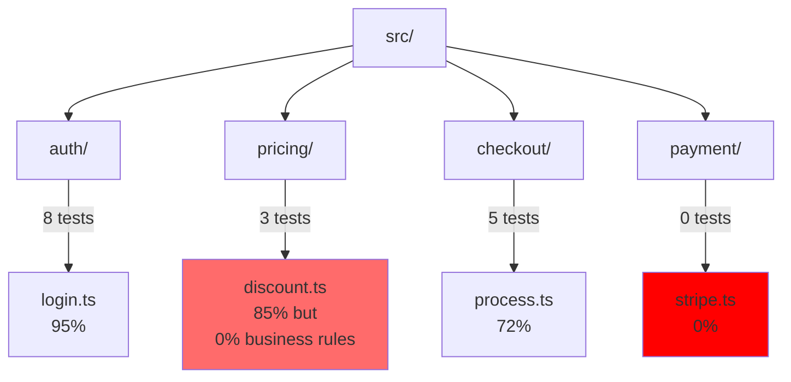
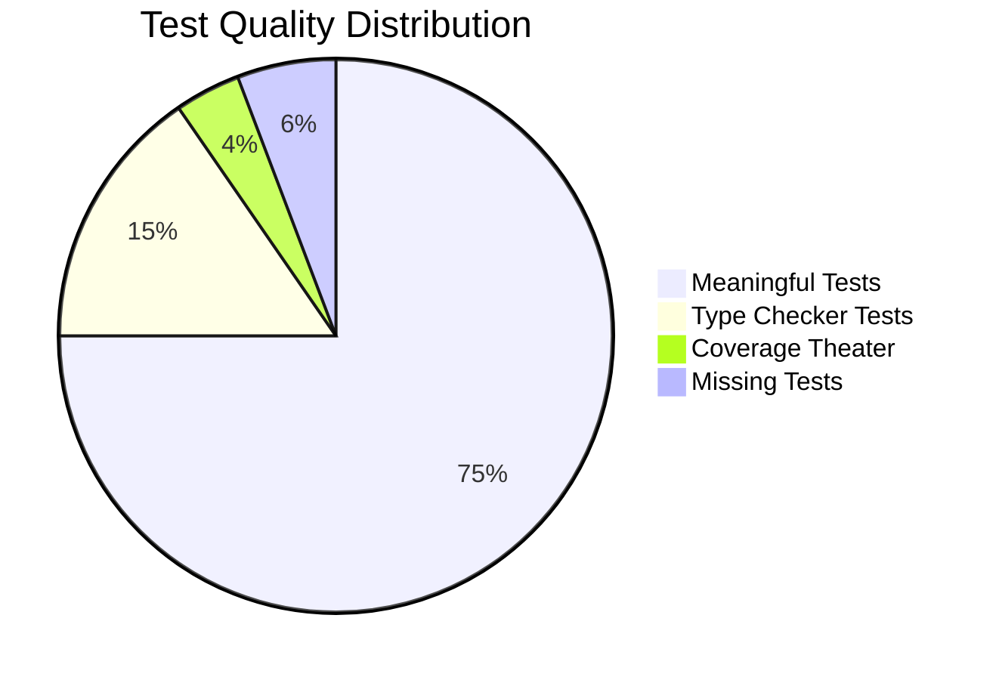
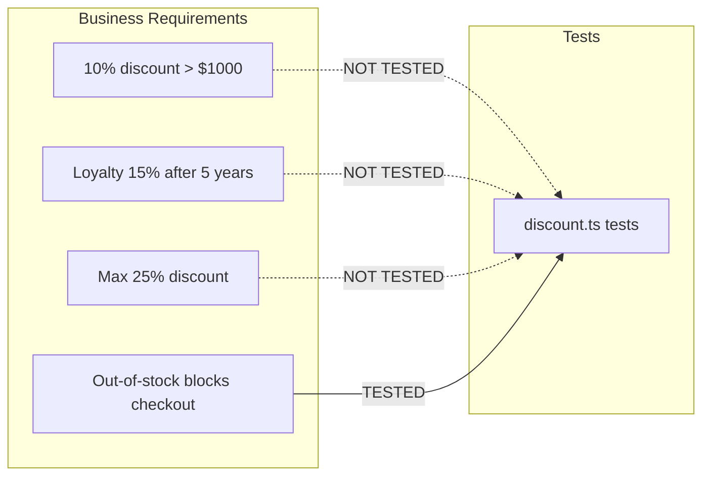
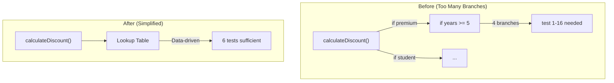
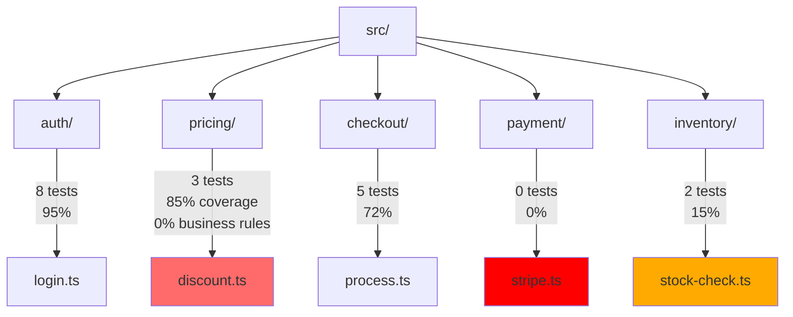
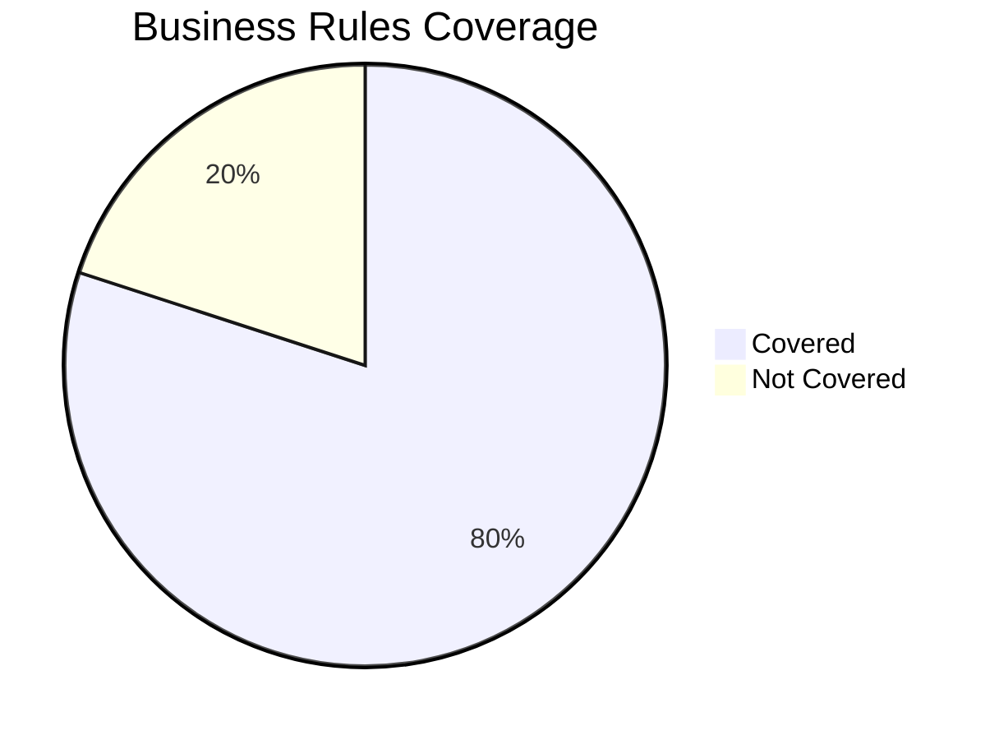

# Test Quality Review Skill

Verify tests actually prove your code solves the right problems.

## Quick Usage

```bash
/test-quality
/test-quality --path=src
/test-quality --report
/test-quality --focus=coverage
```

## Report Output

Reports are generated to: `reports/tests/test-report-<YYYY-MM-DD>.md`

```bash
# Generate report with today's date
/test-quality --report

# Generate for specific path
/test-quality --path=src/features/auth --report

# Generate with specific focus
/test-quality --path=src --focus=coverage --report
```

The report filename uses the current system date (not training data):
- Format: `test-report-YYYY-MM-DD.md`
- Example: `test-report-2026-03-31.md`

## Overview

Test quality is not about coverage percentage. It's about:

1. **Coverage** - Are all code paths tested?
2. **Requirement Traceability** - Do tests verify what the code is supposed to do?
3. **Meaningful Assertions** - Do tests verify behavior, not just implementation?
4. **Business Value** - Do tests ensure the solution answers the real problem?

**A test with 100% coverage that tests the wrong things is worthless.**

## Why Test Quality Matters

### The Problem with Coverage-Only Thinking

| Metric | What It Measures | What It Misses |
|--------|------------------|----------------|
| Line coverage | Lines executed | Why those lines exist |
| Branch coverage | Paths taken | If paths are the right paths |
| Function coverage | Functions called | If functions do the right thing |

### Tests Without Purpose

```typescript
// This achieves 100% coverage but proves nothing
test('calculateTotal returns a number', () => {
  const result = calculateTotal({ items: [] });
  expect(typeof result).toBe('number');
});
```

**This test has:**
- 100% line coverage
- 100% branch coverage
- Zero value - it doesn't verify anything meaningful

### Tests With Purpose

```typescript
// This verifies the business requirement
test('calculateTotal applies 10% discount for orders over $1000', () => {
  const order = {
    items: [
      { price: 600, quantity: 2 },  // $1200 total
    ]
  };

  const total = calculateTotal(order);

  // Business rule: Orders over $1000 get 10% discount
  expect(total).toBe(1080);  // $1200 - 10% = $1080
});
```

**This test:**
- Verifies a specific business rule
- Has a clear reason for existing
- Catches real bugs (wrong discount calculation, missing discount logic)

## Test Quality Dimensions

### 1. Requirement Traceability (30%)

Measures how well tests map to actual requirements.

| Check | Weight | Description |
|-------|--------|-------------|
| Business rules covered | 10 | Each business rule has explicit tests |
| User stories verified | 8 | Critical user flows have tests |
| Edge cases justified | 7 | Edge cases exist for a reason |
| Happy path verified | 5 | Basic functionality works |

### 2. Assertion Quality (25%)

Measures whether assertions verify meaningful behavior.

| Check | Weight | Description |
|-------|--------|-------------|
| Meaningful assertions | 10 | Tests verify outcomes, not types |
| Specific values tested | 8 | Tests use realistic data |
| Error conditions verified | 7 | Failures are tested |

### 3. Coverage Depth (20%)

Measures whether critical paths are covered.

| Check | Weight | Description |
|-------|--------|-------------|
| Branch coverage | 8 | All paths are tested |
| Error paths covered | 7 | Exception paths have tests |
| Integration points | 5 | External calls are mocked/stubbed |

### 4. Test Isolation (15%)

Measures whether tests can run independently.

| Check | Weight | Description |
|-------|--------|-------------|
| No shared state | 6 | Tests don't affect each other |
| Deterministic | 5 | Same result every time |
| Order independent | 4 | Tests can run in any order |

### 5. Maintainability (10%)

Measures whether tests can evolve with code.

| Check | Weight | Description |
|-------|--------|-------------|
| Clear intent | 4 | Test purpose is obvious |
| Self-documenting | 3 | Name describes what/why |
| Minimal setup | 3 | No 50-line before blocks |

## The Test Quality Checklist

### Requirement Traceability

- [ ] Each business rule has at least one explicit test
- [ ] Critical user flows have end-to-end tests
- [ ] Edge cases are documented (why does this edge case exist?)
- [ ] Happy path is verified (does basic functionality work?)

### Assertion Quality

**Good assertions verify outcomes:**

```typescript
// Verifies what happens, not what type it is
expect(order.total).toBe(1080);
expect(user.isActive).toBe(true);
expect(payment.status).toBe('APPROVED');
```

**Bad assertions verify implementation:**

```typescript
// Only proves the code compiles
expect(typeof result).toBe('number');
expect(Array.isArray(items)).toBe(true);
expect(result).toBeDefined();
```

### Coverage Questions

Ask these questions:

1. **What business rule does this line implement?**
2. **Is there a test that proves this rule works?**
3. **If this line is deleted, which test would fail?**

If you can't answer question 3, the line isn't really covered.

## Analyzing Test Quality

### Stage 1: Collect Coverage Data

```bash
# Get line coverage
npx vitest --coverage --coverage.reporters=text

# Get branch coverage
npx vitest --coverage --coverage.reporters=lcov

# Find untested files
grep -r "describe\|test\|it(" src --include="*.test.ts" | cut -d: -f1 | sort | uniq
```

### Stage 2: Map Tests to Requirements

For each test file, identify:

| Test | Business Requirement | Verification Method |
|------|---------------------|--------------------|
| `calculatesDiscountForPremiumUsers` | Premium users get 10% off | 10% discount applied |
| `rejectsInvalidEmails` | Email must be valid | Error returned for invalid |
| `handlesOutOfStock` | Out of stock prevents checkout | Checkout blocked |

### Stage 3: Identify Test Gaps

| Gap Type | Description | Risk |
|----------|-------------|------|
| Missing coverage | Code with no tests | High - bugs hidden |
| Meaningless tests | Tests that pass but prove nothing | High - false confidence |
| Implementation tests | Tests that break on refactor | Medium - maintenance burden |
| Untested rules | Business rules without tests | High - requirement not verified |

## Test Quality Report Format

**Output file:** `reports/tests/test-report-YYYY-MM-DD.md`

The report includes:
- Overall score and grade
- Dimension-by-dimension analysis
- Problematic/useless tests with specific file locations and suggestions
- Missing test coverage with business impact
- Mermaid diagrams for visual analysis when helpful

```markdown
# Test Quality Report

**Generated:** YYYY-MM-DD
**Report Location:** reports/tests/test-report-YYYY-MM-DD.md

## Overall Score: 68/100 (Average - Needs Improvement)

### Grade: C (Below Average)

### Dimension Scores

| Dimension | Score | Weight | Weighted | Status |
|-----------|-------|--------|----------|--------|
| Requirement Traceability | 18/30 | 30% | 18.0 | Warning |
| Assertion Quality | 17/25 | 25% | 17.0 | Good |
| Coverage Depth | 14/20 | 20% | 14.0 | Good |
| Test Isolation | 12/15 | 15% | 12.0 | Good |
| Maintainability | 7/10 | 10% | 7.0 | Warning |

---

## Score Summary

| Metric | Value | Status |
|--------|-------|--------|
| Files with tests | 24/30 (80%) | Good |
| Average coverage | 78% | Good |
| Meaningful tests | 156/200 (78%) | Warning |
| Business rules covered | 12/15 (80%) | Good |
| Excessive test count | 2 files flagged | Critical |
| Test suite size | 450 tests | Review |

---

## Critical Issues

### 1. Meaningless Test Detected

**File:** src/utils/calculate.ts
**Test:** `calculatesTotal returns a number`

```typescript
test('calculatesTotal returns a number', () => {
  const result = calculateTotal({ items: [] });
  expect(typeof result).toBe('number');  // Meaningless!
});
```

**Problem:** This test has 100% coverage but proves nothing.

**Business requirement verified:** None

**Suggestion:** Replace with business-rule test:

```typescript
test('calculateTotal applies 10% discount for orders over $1000', () => {
  const order = { items: [{ price: 600, quantity: 2 }] };
  expect(calculateTotal(order)).toBe(1080);
});
```

---

### 2. Missing Business Rule Test

**File:** src/pricing/discount.ts
**Function:** `applyLoyaltyDiscount()`

**Code coverage:** 85%

**Business rule:** "Loyalty customers with 5+ years get 15% discount"

**Tests covering this rule:** 0

**Impact:** High - this discount could be broken and no test would catch it.

---

## Problematic Tests Analysis

### Tests That Need Improvement

| File | Test Name | Issue | Severity | Suggestion |
|------|-----------|-------|----------|------------|
| src/utils/calculate.ts | `calculatesTotal returns a number` | Type-only assertion | High | Replace with value verification |
| src/auth/login.ts | `handles null user` | Shallow error test | Medium | Test actual error behavior |
| src/api/client.ts | `test 1` through `test 15` | Duplicate patterns | Medium | Consolidate into parameterized tests |

### Useless Tests (Coverage Theater)

| File | Test | Why It's Useless |
|------|------|------------------|
| src/utils/calculate.ts | `returns a number` | Does not verify behavior |
| src/validation.ts | `is not null` | Proves nothing |
| src/pricing/discount.ts | `has discount property` | Type check, not value check |

### Tests With False Confidence

| File | Test | False Confidence | Real Coverage |
|------|------|-----------------|---------------|
| src/checkout/process.ts | 12 tests | 85% coverage | Business rules: 40% |

## Missing Tests Analysis

### Business Rules Without Tests

| Business Rule | File | Impact | Tests Needed |
|---------------|------|--------|--------------|
| Loyalty discount 5+ years = 15% | src/pricing/discount.ts | High - revenue leak | 4 |
| Orders > $1000 get 10% off | src/pricing/discount.ts | High | 3 |
| Max discount cap 25% | src/pricing/discount.ts | Medium | 2 |
| Out-of-stock blocks checkout | src/checkout/process.ts | High | 3 |
| Invalid email format rejected | src/validation/email.ts | High | 2 |

### Edge Cases Not Covered

| Edge Case | File | Risk | Test Suggestion |
|-----------|------|------|-----------------|
| Empty cart checkout | src/checkout/process.ts | High | `prevents checkout with empty cart` |
| Negative quantities | src/orders/items.ts | Medium | `rejects negative quantity` |
| Expired tokens | src/auth/session.ts | Critical | `rejects expired auth token` |
| Network timeout | src/api/client.ts | High | `retries on timeout, fails after 3` |

### Files Without Tests

| File | Complexity | Business Value | Priority |
|------|------------|----------------|----------|
| src/payment/stripe.ts | High | Critical | Immediate |
| src/inventory/stock-check.ts | Medium | High | High |
| src/notifications/email.ts | Low | Medium | Medium |

## Visual Analysis (Mermaid Diagrams)

Use mermaid diagrams when the test structure or coverage gaps are better visualized.

### Test Coverage Map



### Problematic Test Distribution



### Test-to-Business-Rule Mapping



### Recommended Test Structure



## Test Quality Anti-Patterns

### The "Type Checker" Test

```typescript
// Bad - proves nothing
test('user is an object', () => {
  expect(typeof user).toBe('object');
  expect(user !== null).toBe(true);
});

// Good - proves something
test('user has required fields for authentication', () => {
  expect(user.email).toBeDefined();
  expect(user.passwordHash).toBeDefined();
});
```

### The "Happy Path Only" Test

```typescript
// Bad - only tests success
test('processOrder succeeds with valid order', () => {
  const result = processOrder(validOrder);
  expect(result.status).toBe('SUCCESS');
});

// Good - tests the domain
test('processOrder fails when inventory insufficient', () => {
  const order = { ...validOrder, items: [{ sku: 'OUT_OF_STOCK' }] };
  const result = processOrder(order);
  expect(result.status).toBe('INSUFFICIENT_INVENTORY');
  expect(result.error.code).toBe('INVENTORY_SHORTAGE');
});
```

### The "Coverage Theater" Test

```typescript
// Bad - exists only to improve coverage metrics
test('handles empty array', () => {
  const result = processItems([]);
  expect(Array.isArray(result)).toBe(true);
});

// Good - tests a real scenario
test('returns empty array when no items match filter', () => {
  const items = [{ active: false }, { active: false }];
  const result = processItems(items);
  expect(result).toEqual([]);
  // This matters: empty filter results should be handled
});
```

## Coverage vs. Quality

| Coverage % | Quality | Interpretation |
|------------|---------|----------------|
| 90%+ | Low | "Coverage theater" - tests exist but don't verify anything |
| 80-90% | Medium | Some meaningful tests, gaps exist |
| 70-80% | Good | Most important paths covered |
| <70% | Warning | Critical paths likely uncovered |
| Any % | High | Tests verify real business rules |

**The goal is not 100% coverage. The goal is verified business requirements.**

## Test Quality Scoring System

### Score Calculation

Each dimension contributes to an overall score:

| Dimension | Weight | Max Score |
|-----------|--------|-----------|
| Requirement Traceability | 30% | 30 |
| Assertion Quality | 25% | 25 |
| Coverage Depth | 20% | 20 |
| Test Isolation | 15% | 15 |
| Maintainability | 10% | 10 |
| **Total** | **100%** | **100** |

### Grade Scale

| Grade | Score | Interpretation |
|-------|-------|----------------|
| A+ | 95-100 | Exceptional - tests are exemplary |
| A | 90-94 | Excellent - tests verify requirements well |
| A- | 85-89 | Very Good - minor improvements possible |
| B+ | 80-84 | Good - solid test suite with minor gaps |
| B | 75-79 | Good - most requirements covered |
| B- | 70-74 | Acceptable - some gaps to address |
| C+ | 65-69 | Average - several issues to fix |
| C | 60-64 | Below Average - significant improvements needed |
| D | 50-59 | Poor - major issues with test quality |
| F | <50 | Failing - tests don't verify requirements |

### Score Interpretation

| Score Range | Status | Action Required |
|-------------|--------|-----------------|
| 85-100 | Excellent | Maintain quality, occasional improvements |
| 70-84 | Good | Address identified gaps |
| 50-69 | Average | Significant refactoring recommended |
| <50 | Poor | Major overhaul required |

### Dimension-Specific Scoring

#### Requirement Traceability (30 points max)

| Score | Description |
|-------|-------------|
| 25-30 | All business rules have explicit tests with clear documentation |
| 20-24 | Most business rules covered, minor gaps |
| 15-19 | Key requirements covered, some important gaps |
| 10-14 | Only basic functionality tested |
| <10 | Tests don't verify actual requirements |

#### Assertion Quality (25 points max)

| Score | Description |
|-------|-------------|
| 22-25 | All assertions verify meaningful outcomes with specific values |
| 18-21 | Most assertions are meaningful, few "type checker" tests |
| 14-17 | Mixed - some meaningful, some shallow |
| 10-13 | Many assertions only check types/existence |
| <10 | Most assertions are meaningless |

#### Coverage Depth (20 points max)

| Score | Description |
|-------|-------------|
| 18-20 | All critical paths covered, edge cases addressed |
| 15-17 | Most critical paths covered, minor gaps |
| 12-14 | Basic coverage, missing edge cases |
| 8-11 | Significant gaps in coverage |
| <8 | Critical paths untested |

#### Test Isolation (15 points max)

| Score | Description |
|-------|-------------|
| 14-15 | All tests are isolated, deterministic, order-independent |
| 12-13 | Most tests are isolated, minor issues |
| 9-11 | Some shared state or order dependencies |
| 6-8 | Significant isolation issues |
| <6 | Tests are flaky and interdependent |

#### Maintainability (10 points max)

| Score | Description |
|-------|-------------|
| 9-10 | Tests are clear, self-documenting, minimal setup |
| 7-8 | Tests are readable, minor complexity |
| 5-6 | Some tests are hard to understand |
| 3-4 | Tests are difficult to maintain |
| <3 | Tests are a maintenance burden |

### Scoring Examples

#### Example 1: High Score (A grade)

| Dimension | Score | Evidence |
|-----------|-------|----------|
| Requirement Traceability | 28/30 | All 12 business rules have explicit tests |
| Assertion Quality | 23/25 | Assertions verify specific values, not types |
| Coverage Depth | 18/20 | All critical paths + edge cases covered |
| Test Isolation | 14/15 | Tests run independently, no shared state |
| Maintainability | 9/10 | Clear test names, minimal setup |
| **Total** | **92/100** | **Grade: A** |

#### Example 2: Low Score (D grade)

| Dimension | Score | Evidence |
|-----------|-------|----------|
| Requirement Traceability | 12/30 | Only happy path tested, no business rules verified |
| Assertion Quality | 8/25 | 80% of tests only check types |
| Coverage Depth | 10/20 | Missing error paths, untested edge cases |
| Test Isolation | 8/15 | Tests share state, order-dependent |
| Maintainability | 4/10 | Confusing test names, 50-line setup blocks |
| **Total** | **42/100** | **Grade: F** |

## Business Value Alignment

### Questions Every Test Should Answer

1. **What business rule does this test verify?**
2. **What happens if this code is wrong?**
3. **How does this test prove the code solves the right problem?**

### Test Documentation Template

```typescript
/**
 * TEST: applyLoyaltyDiscount
 *
 * BUSINESS REQUIREMENT: Loyalty customers with 5+ years get 15% discount
 * BUSINESS IMPACT: Without this, long-term customers leave for competitors
 *
 * SCENARIO: Customer with 6 years loyalty
 * INPUT: order.total = $1000, customer.loyaltyYears = 6
 * EXPECTED: discount = $150, final = $850
 *
 * SCENARIO: Customer with 3 years loyalty
 * INPUT: order.total = $1000, customer.loyaltyYears = 3
 * EXPECTED: discount = $0 (not eligible yet)
 */
test('applies 15% discount for loyalty customers with 5+ years', () => {
  const customer = { loyaltyYears: 6 };
  const order = { total: 1000 };

  const result = applyLoyaltyDiscount(order, customer);

  expect(result.discount).toBe(150);
  expect(result.finalTotal).toBe(850);
});
```

## Report Template

**Output:** `reports/tests/test-report-YYYY-MM-DD.md`

```markdown
# Test Quality Report

**Generated:** YYYY-MM-DD (from system clock)
**Report Location:** reports/tests/test-report-YYYY-MM-DD.md

## Executive Summary

| Metric | Value | Status |
|--------|-------|--------|
| Overall Score | 68/100 | C (Below Average) |
| Files with tests | 24/30 (80%) | Good |
| Average coverage | 78% | Good |
| Meaningful tests | 156/200 (78%) | Warning |
| Business rules covered | 12/15 (80%) | Good |
| Excessive test count | 2 files flagged | Critical |
| Problematic tests | 12 identified | Review |
| Missing tests | 15 identified | Critical |

---

## Overall Score

| Dimension | Score | Max | Status |
|-----------|-------|-----|--------|
| Requirement Traceability | 18 | 30 | Warning |
| Assertion Quality | 17 | 25 | Good |
| Coverage Depth | 14 | 20 | Good |
| Test Isolation | 12 | 15 | Good |
| Maintainability | 7 | 10 | Warning |

**Grade: C (Below Average)**

---

## Coverage by File

| File | Coverage | Tests | Quality | Issues |
|------|----------|-------|---------|--------|
| src/auth/login.ts | 95% | 8 | Good | None |
| src/pricing/discount.ts | 85% | 3 | **Poor** | Business rules not tested |
| src/checkout/process.ts | 72% | 5 | Good | None |
| src/payment/stripe.ts | 0% | 0 | **Missing** | No tests |
| src/inventory/stock-check.ts | 15% | 2 | **Poor** | Only happy path |

---

## Problematic Tests

### Tests That Need Improvement

| File | Test Name | Issue | Severity | Suggestion |
|------|-----------|-------|----------|------------|
| src/utils/calculate.ts | `calculatesTotal returns a number` | Type-only assertion | High | Replace with value verification |
| src/auth/login.ts | `handles null user` | Shallow error test | Medium | Test actual error behavior |
| src/api/client.ts | Multiple | Duplicate patterns | Medium | Consolidate into parameterized tests |

### Useless Tests (Coverage Theater)

| File | Test | Why It's Useless | Action |
|------|------|------------------|--------|
| src/utils/calculate.ts | `returns a number` | Does not verify behavior | Remove or replace |
| src/validation.ts | `is not null` | Proves nothing | Remove or replace |
| src/pricing/discount.ts | `has discount property` | Type check only | Remove or replace |

---

## Missing Tests

### Business Rules Without Tests

| Business Rule | File | Impact | Tests Needed | Priority |
|---------------|------|--------|--------------|----------|
| Loyalty discount 5+ years = 15% | src/pricing/discount.ts | High | 4 | Immediate |
| Orders > $1000 get 10% off | src/pricing/discount.ts | High | 3 | Immediate |
| Max discount cap 25% | src/pricing/discount.ts | Medium | 2 | High |
| Out-of-stock blocks checkout | src/checkout/process.ts | High | 3 | Immediate |
| Invalid email rejected | src/validation/email.ts | High | 2 | High |

### Files Without Tests

| File | Complexity | Business Value | Priority |
|------|------------|----------------|----------|
| src/payment/stripe.ts | High | Critical | Immediate |
| src/inventory/stock-check.ts | Medium | High | High |
| src/notifications/email.ts | Low | Medium | Medium |

---

## Visual Analysis

### Test Coverage Map



### Test-to-Business-Rule Coverage



---

## Recommendations

### High Priority

1. **Add business-rule tests to discount.ts**
   - Current tests only verify types, not values
   - Add test for order > $1000 threshold
   - Add test for stacking discounts

2. **Remove meaningless tests**
   - 12 tests only verify types or existence
   - Replace with behavior-verifying tests

3. **Add tests to stripe.ts**
   - Critical payment functionality has 0 tests
   - High business risk

### Medium Priority

3. **Add error path coverage**
   - Currently only testing happy paths
   - Add tests for validation failures
   - Add tests for external service failures

---

## GitHub Issue Draft

```markdown
## Improve test quality for pricing module

### Problem

Tests in src/pricing have 85% coverage but only verify implementation:
- No tests verify discount calculation logic
- No tests verify discount stacking rules
- 3 tests only check types, not behavior

### Business Requirements at Risk

1. Orders over $1000 get 10% discount - NOT TESTED
2. Loyalty discount stacks with order discount - NOT TESTED
3. Maximum discount cap of 25% - NOT TESTED

### Current State

- Coverage: 85%
- Meaningful tests: 3/8 (37%)
- Business rules verified: 0/5 (0%)

### Proposed Changes

1. Replace type-checking tests with behavior tests
2. Add explicit tests for each discount rule
3. Document business rules in test descriptions

### Effort

~2 hours across 3 files
```
```

---

## Confirmation

**This skill will NOT create issues without your confirmation.**

**This skill will NOT write report files without your confirmation.**

---

## Report Generation

To generate the report file:

```bash
# Create reports directory if needed
mkdir -p reports/tests

# Generate report with current system date
# (The date is obtained at runtime, not hardcoded)

# For Linux/Mac:
cat > "reports/tests/test-report-$(date +%Y-%m-%d).md" << 'EOF'
# (paste report content here)
EOF

# For Windows (PowerShell):
$date = Get-Date -Format "yyyy-MM-dd"
$report = @"
# (paste report content here)
"@
Set-Content -Path "reports/tests/test-report-$date.md" -Value $report
```

**Important:** The date `$(date +%Y-%m-%d)` or `Get-Date -Format "yyyy-MM-dd"` is resolved at runtime from the system clock, not from training data.

## When Too Many Tests Is a Code Smell

**Warning: A file requiring dozens of tests often indicates the code itself has too many branches.**

### The Branch-Test Relationship

| Branches in Code | Tests Needed for Full Coverage | Implication |
|-----------------|-------------------------------|-------------|
| 3 | 8 | Code is manageable |
| 5 | 32 | Getting complex |
| 10 | 1024 | Code needs simplification |
| 15+ | 32768+ | Code is unmaintainable |

**A file with 50 tests for 80% coverage is not well-tested. It is over-engineered.**

### Too Many Tests Indicates

| Symptom | Problem | Solution |
|---------|---------|----------|
| 30+ tests for one function | Function has too many branches | Split into smaller functions |
| 50+ tests for one file | File has too many responsibilities | Split into modules |
| Nested describe blocks (4+ levels) | Deeply nested logic | Use early returns, simplify |
| Many variations of same test | Branch explosion | Data-driven approach |

### The Branch Minimization Rule

```
Before writing more tests, ask: Can we simplify the code?

If a function requires 20 tests to cover all paths:
1. Can we reduce the number of paths?
2. Can we use lookup tables instead of conditionals?
3. Can we extract helper functions?
4. Can we use @deessejs/fp Result/Maybe to reduce null checks?
```

### Example: Refactor Before Adding Tests

**Before (Too many branches, too many tests needed):**

```typescript
// This function needs 16 tests to cover all paths
function calculateDiscount(user: User, order: Order): number {
  if (user.isPremium) {
    if (user.years >= 5) {
      if (order.total >= 1000) return 0.15;
      if (order.total >= 500) return 0.1;
      return 0.05;
    }
    if (user.years >= 2) {
      if (order.total >= 1000) return 0.1;
      if (order.total >= 500) return 0.08;
      return 0.03;
    }
  }
  if (user.isStudent) {
    if (order.total >= 1000) return 0.1;
    if (order.total >= 500) return 0.05;
  }
  return 0;
}

// Tests needed: 16 (2^4 branches)
```

**After (Simplified, fewer tests needed):**

```typescript
// Lookup table eliminates branches
const DISCOUNT_RATES = {
  premium: {
    years5: { high: 0.15, mid: 0.1, low: 0.05 },
    years2: { high: 0.1, mid: 0.08, low: 0.03 },
    default: { high: 0.05, mid: 0.03, low: 0 }
  },
  student: {
    high: 0.1,
    mid: 0.05,
    low: 0
  },
  default: { high: 0, mid: 0, low: 0 }
};

// Tests needed: 6 (far fewer paths)
```

### When to Flag for Simplification

| Metric | Threshold | Action |
|--------|-----------|--------|
| Tests per function | > 10 | Flag for review |
| Branches per function | > 5 | Consider simplification |
| Nested describe blocks | > 3 levels | Refactor needed |
| Coverage but low assertions | > 20% difference | "Coverage theater" |
| Total tests for one file | > 50 | Code likely needs simplification |

### The Simplify-Code Integration

**When test-quality finds excessive tests, recommend simplify-code:**

```markdown
## Excessive Test Count Detected

**File:** src/pricing/discount-calculator.ts

**Problem:** 47 tests for 82% coverage

**Analysis:**
- Function has 6+ branches (nested if/else)
- Each branch combination requires separate test
- Tests are hard to maintain

**Recommendation:** Use [simplify-code skill](../simplify-code-skill/SKILL.md)
- Replace nested if/else with lookup table
- Use @deessejs/fp Result/Maybe to eliminate null checks
- Target: < 10 tests for same coverage
- Expected reduction: 80% fewer tests
```

### Anti-Pattern: Test Proliferation

| Anti-Pattern | What It Looks Like | Problem |
|--------------|-------------------|---------|
| Test explosion | 30+ tests for one function | Code has too many branches |
| Variation testing | Same test with different values | Missing data-driven approach |
| Branch coverage theater | Tests only exist to cover branches | Tests don't verify behavior |
| Future-proofing tests | Tests for hypothetical cases | YAGNI - tests for code that doesn't exist |

## Test Quality Principles

### The Test Purpose Hierarchy

1. **Prove the code solves the right problem** (business value)
2. **Prove the code works correctly** (functional correctness)
3. **Prove edge cases are handled** (robustness)
4. **Prove the code doesn't break** (regression prevention)

Coverage is only useful for #2-#4. If #1 is not met, coverage is meaningless.

### Good Test Characteristics

| Characteristic | Description |
|----------------|-------------|
| **Verifies outcome** | Tests behavior, not implementation |
| **Has clear purpose** | Name describes what and why |
| **Uses real data** | Values match production scenarios |
| **Fails for a reason** | When it fails, you know why |
| **Documents requirement** | Test serves as specification |

### Bad Test Characteristics

| Characteristic | Why It's Bad |
|----------------|-------------|
| Tests implementation | Breaks on refactor |
| No assertions | Proves nothing |
| Only happy path | Hidden bugs in errors |
| Shared state | Flaky, order-dependent |
| Overly specific | Brittle, breaks on valid changes |

## Coverage Analysis Process

### Step 1: Get Coverage Data

```bash
# Run tests with coverage
npx vitest --coverage

# Generate HTML report
npx vitest --coverage --coverage.reporters=html

# Check specific file
npx vitest --coverage --coverage.include="src/pricing/**/*.ts"
```

### Step 2: Cross-Reference Source with Tests

Verify each exported function has corresponding tests:

```bash
# Find all exported functions in source
grep -rh "^export " src/ --include="*.ts" | grep -o "export const \w\+" | sort | uniq

# Find corresponding test imports
grep -rh "import.*from.*\.\./" tests/ --include="*.test.ts" | sort | uniq

# Alternative: Check if test file exists for each source file
for file in src/**/*.ts; do
  test_file="tests/${file##*/}.test.ts"
  if [ ! -f "$test_file" ]; then
    echo "MISSING: $test_file for $file"
  fi
done

# Check assertion density (assertions per line)
# A 50-line test with 1 assertion is suspicious
wc -l tests/**/*.test.ts
grep -c "expect(" tests/**/*.test.ts
```

### Step 3: Identify "Coverage Theater"

```bash
# Find tests that only check types
grep -r "toBeDefined\|toBeTruthy\|typeof" --include="*.test.ts"

# Find tests with no meaningful assertions
grep -r "expect(result)" --include="*.test.ts" | grep -v "\.to"
```

### Step 3: Map to Business Requirements

For each untested or poorly tested file:

1. What business rule does this implement?
2. What test would prove this rule works?
3. What test would prove this rule fails correctly?

### Step 4: Assess Quality

| Question | Yes | No |
|----------|-----|-----|
| Does each test verify a business rule? | +10 | -10 |
| Do tests use realistic data? | +5 | -3 |
| Are error paths tested? | +5 | -5 |
| Can tests run in any order? | +5 | -5 |

## Requirement Source Discovery

Before scoring Requirement Traceability, identify where requirements come from.

### Finding Requirements

```bash
# Look for requirements documentation
ls -la *.md | grep -i require
ls -la docs/ | grep -i require
ls -la specs/ 2>/dev/null

# Check README for business rules
grep -r "business\|rule\|requirement" README.md docs/

# Look for BDD/Gherkin specs
find . -name "*.feature" 2>/dev/null
```

### Requirement Traceability Score Adjustment

| Source Found | Score Impact |
|-------------|--------------|
| Explicit requirements docs (specs/, requirements.md) | Full score possible |
| README/Markdown scattered | Score capped at 70% |
| No requirements found | Score capped at 50%, flag as "Inferred/Unverified" |

**If requirements are implicit or undocumented, note this in the report:**

```markdown
### Requirement Traceability: 12/30 (Capped)

**Note:** No explicit requirements.md or specs/ found. Business rules were
inferred from code and may not reflect actual requirements. Recommend
creating requirements documentation for accurate traceability.
```

## Mutation Testing

The most objective measure of test quality is whether tests fail when code is changed incorrectly.

### What is Mutation Testing?

Mutation testing modifies your code slightly:
- Change `>` to `>=`
- Change `+` to `-`
- Change `&&` to `||`

If tests still pass after these changes, the tests are weak.

### Running Mutation Tests

```bash
# Install Stryker Mutator
npm install @stryker-mutator/core @stryker-mutator/typescript

# Run mutation testing
npx stryker run

# Check specific file
npx stryker run --mutate src/pricing/discount.ts
```

### Mutation Testing Interpretation

| Kill Rate | Quality | Action |
|-----------|---------|--------|
| >80% | Excellent | Tests are robust |
| 60-80% | Good | Minor improvements |
| 40-60% | Average | Address surviving mutants |
| <40% | Poor | Significant test weakness |

**Add to report:**

```markdown
### Mutation Testing Results

**File:** src/pricing/discount.ts
**Mutants:** 24
**Killed:** 14 (58%)
**Survived:** 10

**Problem:** Surviving mutants indicate tests don't catch:
- Wrong comparison operators (2 mutants)
- Incorrect discount calculation (4 mutants)
- Missing boundary checks (4 mutants)
```

## Property-Based Testing

For complex logic with many combinations, manual test cases are insufficient.

### When to Use Property-Based Testing

- Functions with multiple input parameters
- Complex business rules with many conditions
- Discount/calculation logic
- Parsing/transformation functions

### Example with fast-check

```typescript
import { fc } from 'fast-check';

// Instead of 50 manual tests for calculateDiscount
test('calculateDiscount respects all business rules', () => {
  fc.assert(
    fc.property(
      fc.record({
        isPremium: fc.boolean(),
        isStudent: fc.boolean(),
        years: fc.integer({ min: 0, max: 20 }),
        total: fc.float({ min: 0, max: 10000 })
      }),
      (order) => {
        const result = calculateDiscount(order);

        // Property 1: Discount never negative
        expect(result.discount).toBeGreaterThanOrEqual(0);

        // Property 2: Discount never exceeds total
        expect(result.discount).toBeLessThanOrEqual(result.total);

        // Property 3: Max 25% discount cap
        expect(result.discount).toBeLessThanOrEqual(result.total * 0.25);

        // Property 4: Premium + 5 years always gets best rate
        if (order.isPremium && order.years >= 5) {
          expect(result.discount).toBe(result.total * 0.15);
        }
      }
    ),
    { numRuns: 1000 }
  );
});
```

### Recommendation in Report

```markdown
### Property-Based Testing Recommended

**File:** src/pricing/discount.ts

**Reason:** Function has 6 branches, requiring 64 manual tests for full
coverage. Property-based testing can verify invariants with fewer tests.

**Tool:** fast-check
**Effort:** 2 hours to implement
**Coverage gain:** Comprehensive
```

## Flakiness Detection

Tests that fail randomly destroy confidence in the test suite.

### Flaky Test Indicators

```bash
# Look for these patterns in tests:

# setTimeout or sleep
grep -r "setTimeout\|sleep\|waitFor" --include="*.test.ts"

# Hardcoded dates
grep -r "new Date()" --include="*.test.ts" | grep -v "mock"

# External API dependence
grep -r "fetch\|axios\|http" --include="*.test.ts" | grep -v "mock\|stub"

# Time-dependent logic
grep -r "Date.now\|Date.parse" --include="*.test.ts"
```

### Flakiness Patterns

| Pattern | Problem | Solution |
|---------|---------|----------|
| `setTimeout(fn, 100)` | Race condition | Use `waitFor` with assertion |
| `new Date()` in test | Time-dependent | Mock system clock |
| Real API calls | External dependency | Mock with MSW or nock |
| Random data | Non-deterministic | Seed random generator |

### Flakiness Report Section

```markdown
### Flaky Tests Detected

| File | Test | Issue | Severity |
|------|------|-------|----------|
| src/auth/session.ts | `handles token expiry` | Uses `new Date()` | High |
| src/api/client.ts | `handles network` | Real HTTP calls | Critical |
| src/notifications/email.ts | Multiple | setTimeout in tests | Medium |

**Recommendation:** Mock system clock, use MSW for HTTP, remove setTimeout.
```

## Senior Advice

> "A test that always passes tells you nothing. A test that fails tells you everything."

> "100% coverage with meaningless tests is like having 500 pages of documentation that no one reads."

> "If you can't explain what business requirement a test verifies, the test shouldn't exist."

> "Tests should make you confident your code works. If your tests don't catch bugs, they're not tests - they're noise."

> "The best test is one that fails today and would have caught yesterday's bug."

> "Coverage metrics exist to find gaps. They don't prove your code works."

> "A test that tests implementation is a liability. It breaks on every refactor."

> "Every test should answer: What problem does this solve? What happens if this code is wrong?"

> "50 tests for one function is not a sign of good coverage. It's a sign the code has too many branches."

> "If your test suite takes an hour to run because of hundreds of tests, the code probably needs simplification first."

> "The goal is not to prove the code works. The goal is to prove the code solves the right problem."

> "If you have to mock five different dependencies to test one function, your code is too tightly coupled. The test is crying for a refactor."

> "A test suite that takes longer than 5 minutes to run is a suite that people will eventually stop running. Speed is a quality metric."

> "The most valuable test is an integration test on a critical path. The most expensive test is a unit test on a trivial utility."

## Additional Resources

- For architecture review, see [senior-review-skill](../senior-review-skill/SKILL.md)
- For code simplification, see [simplify-code-skill](../simplify-code-skill/SKILL.md)
- For documentation scoring, see [doc-score-skill](../doc-score-skill/SKILL.md)
- For dead code detection, see [dead-code-skill](../dead-code-skill/SKILL.md)
